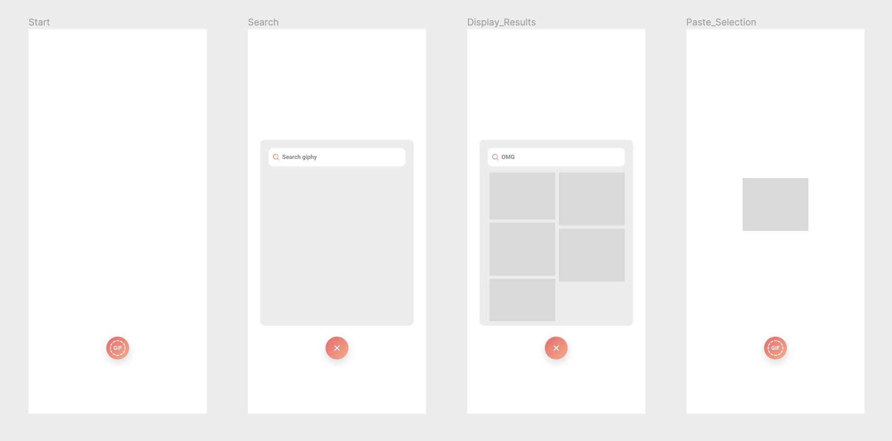

# Unsplash Coding Challenge

Our goal with this challenge is to get a sense for how you write code and solve problems.

## Task

Please write a minimal React app (CRA, Next.js or whatever you prefer), that implements a simple search for Images via the [Unsplash API](https://unsplash.com/documentation).

Therefore, you will need to implement a single view 4 different states.

Pressing the initially visible button, reveals the search form with an input field.

After entering a search term in the input field, 12 Images should be fetched from the Unsplash API and displayed in a scrollable grid below.

Clicking on a Image in the grid, selects the Image and displays it on its own.

Please fork this repository and deliver your code as a Pull Request on GitHub. Make sure to document how to run your application.

## Design

Please have a look at the provided [Figma design](https://www.figma.com/file/Vs4z1roSGBv8yP63pexV1J/Coding_Challenge_UI?node-id=0%3A1&t=i7wxMmYKcI3gXjQs-1). The solution does not have to be pixel perfect, but should resemble the design as close as possible.

## Hints

- Use whatever tools/libraries/frameworks that help you to achieve a good result, but ​do not add unnecessary dependencies
- Think & develop in ​components
- UX/UI​: Does the form adapt well to different devices (mobile/desktop)?
- BONUS: Make ​regular commits​ as in your usual workflow, instead of pushing everything all at once)
- Have fun!

Asking questions is good​. We are happy to help and will not penalize you for
asking questions (just drop a line to h.schwager@acehub.io).
